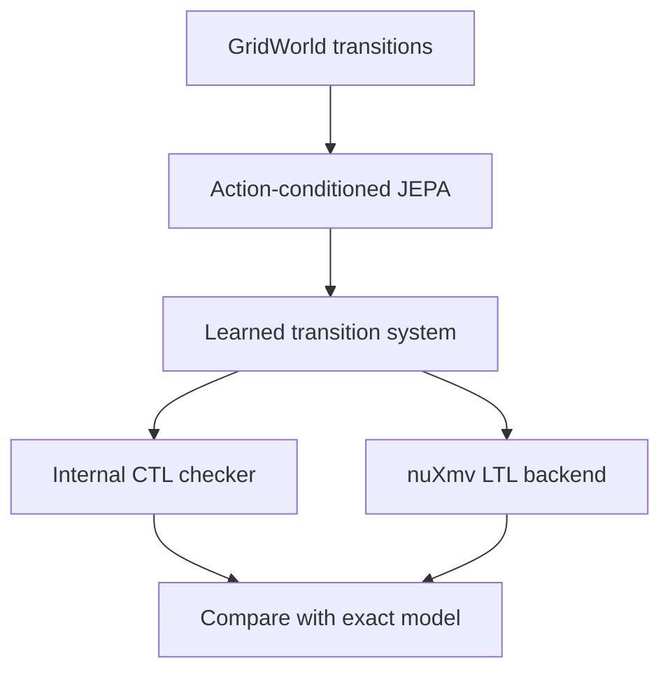

# JEPA-LMC

JEPA-LMC is a research prototype for learning an action-conditioned latent
transition model and reusing the resulting finite transition system across
formal-verification backends.

The central experiment is **train once, verify many**. JEPA training uses only
state, action, and next-state observations. Temporal-logic formulae and verdicts
are not training labels. After training, the frozen dynamics are decoded into
one labelled transition system and evaluated with CTL and LTL backends.

## System overview



The current prototype deliberately copies exact atomic-proposition labels when
reconstructing the learned graph. It therefore evaluates learned **transition
fidelity**, not end-to-end proposition recognition.

## Repository map

The source tree is organized by responsibility rather than development date:

```text
configs/                 Fixed hand-written environment configuration
experiments/             Five reproducible research entry points
src/jepa_lmc/
  envs/                  GridWorld and YAML configuration loading
  verification/          Transition systems, CTL/LTL, witnesses, nuXmv adapter
  learning/              JEPA observations, model, loss, and training loop
  benchmarks/            Random maps, property suites, controlled perturbations
  evaluation/            Transition/rollout retrieval and verification metrics
tests/                   Unit, identity, replay, and differential-oracle tests
```

The dependency direction is intentionally one-way:

```text
envs -> learning -> evaluation
  \        \          /
   -> benchmarks -> verification
```

`experiments/` contains orchestration only; reusable algorithms belong under
`src/jepa_lmc/`.

## Install on Windows PowerShell

Create a virtual environment and install the project in editable mode:

```powershell
py -3.11 -m venv .venv
& .\.venv\Scripts\python.exe -m pip install --upgrade pip
& .\.venv\Scripts\python.exe -m pip install -e .
```

Editable installation replaces the former manual `PYTHONPATH=src` setup. If
nuXmv is unpacked inside the repository, keep it untracked and expose its path:

```powershell
$env:NUXMV_BINARY = "$PWD\nuXmv-2.1.0-win64\bin\nuXmv.exe"
```

Run all tests:

```powershell
& .\.venv\Scripts\python.exe -m unittest discover -v
```

## Experiment entry points

| Script | Purpose |
|---|---|
| `experiments/exact_ctl.py` | Exact CTL baseline, witness, and counterexample |
| `experiments/benchmark_ctl.py` | Random-map CTL scorecard and perturbation sensitivity |
| `experiments/validate_ctl_oracle.py` | CTL identities and differential validation against nuXmv |
| `experiments/evaluate_jepa.py` | JEPA transitions, rollouts, ablation, and CTL fidelity |
| `experiments/evaluate_multibackend.py` | One frozen JEPA evaluated by CTL and LTL |

Typical commands:

```powershell
& .\.venv\Scripts\python.exe experiments\exact_ctl.py
& .\.venv\Scripts\python.exe experiments\validate_ctl_oracle.py
& .\.venv\Scripts\python.exe experiments\evaluate_jepa.py
& .\.venv\Scripts\python.exe experiments\evaluate_multibackend.py
```

For a fast end-to-end smoke run:

```powershell
& .\.venv\Scripts\python.exe experiments\evaluate_multibackend.py `
  --train-maps 10 --test-maps 2 --epochs 5
```

## Completed milestones

- exact finite-state GridWorld transition generation;
- explicit-state CTL checking with witnesses and counterexamples;
- randomized CTL identities and differential validation against nuXmv;
- reproducible random-map train/validation/test splits;
- action-conditioned JEPA with EMA target encoder and anti-collapse losses;
- held-out next-state, open-loop rollout, safety, and CTL evaluation;
- CTL/LTL multi-backend evaluation of one frozen JEPA model.

## Key pilot results

The deterministic JEPA pilot used 40 training maps and 10 disjoint test maps.

| Metric | Action-JEPA | Action-masked ablation |
|---|---:|---:|
| Top-1 next-state accuracy | 94.3% | 28.0% |
| Top-3 next-state accuracy | 99.7% | 56.1% |
| Danger-destination recall | 94.6% | 25.0% |
| CTL agreement | 94.7% | 40.9% |
| False-safe CTL verdicts | 0 | 252 |

Open-loop state accuracy fell from 95.6% at horizon 1 to 26.1% at horizon 8.
The primary balanced CTL score was 68.5%, so overall agreement must not be
interpreted as formal equivalence or a safety guarantee.

## Research scope and limitations

This project currently studies deterministic finite GridWorlds with closed-set
nearest-neighbour latent decoding. nuXmv validates the symbolic oracle; it does
not certify that the learned JEPA graph is identical to the environment. The
prototype has no bisimulation guarantee, learned proposition labelling,
probabilistic dynamics, clock semantics, or long-horizon reliability guarantee.

The next research question is how to preserve JEPA Top-k transition uncertainty
and propagate it into conservative `true` / `false` / `unknown` verification
outcomes while minimizing false-safe verdicts.
