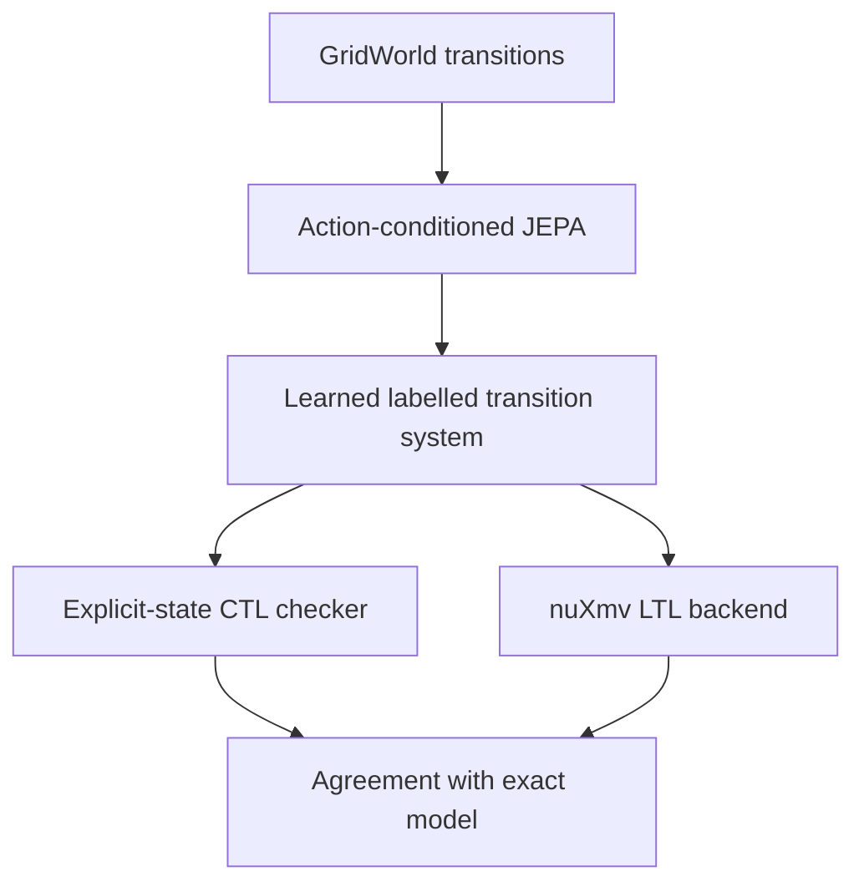

# JEPA-LMC

JEPA-LMC is a research prototype for learning an action-conditioned latent
transition model and reusing the resulting finite transition system across
formal-verification backends.

The central experiment is **train once, verify many**: JEPA training uses only
state/action/next-state observations. Temporal-logic formulae and verdicts are
not training labels. After training, the frozen learned dynamics are decoded
into one labelled transition system and checked against previously unseen
properties.

## Architecture



The current prototype deliberately keeps exact atomic-proposition labels when
reconstructing the learned graph. It therefore evaluates learned **transition
fidelity**, not end-to-end proposition recognition.

## Completed milestones

- exact finite-state GridWorld transition generation;
- explicit-state CTL checking with witnesses and counterexamples;
- randomized CTL identities and differential validation against nuXmv;
- reproducible random-map train/validation/test splits;
- action-conditioned JEPA with EMA target encoder and latent anti-collapse
  regularization;
- held-out next-state, open-loop rollout, safety, and CTL evaluation;
- CTL/LTL multi-backend evaluation of one frozen JEPA model.

## Step 04B pilot

The deterministic pilot used 40 training maps and 10 disjoint test maps.

| Metric | Action-JEPA | Action-masked ablation |
|---|---:|---:|
| Top-1 next-state accuracy | 94.3% | 28.0% |
| Top-3 next-state accuracy | 99.7% | 56.1% |
| Danger-destination recall | 94.6% | 25.0% |
| CTL agreement | 94.7% | 40.9% |
| False-safe CTL verdicts | 0 | 252 |

Open-loop state accuracy fell from 95.6% at horizon 1 to 26.1% at horizon 8.
The primary balanced CTL score was 68.5%, so the overall agreement must not be
interpreted as formal equivalence or a safety guarantee.

## Reproduce on Windows PowerShell

Create and activate a virtual environment, install `requirements.txt`, and set
the source path:

```powershell
$env:PYTHONPATH = "$PWD\src"
$env:NUXMV_BINARY = "$PWD\nuXmv-2.1.0-win64\bin\nuXmv.exe"
```

Run all tests:

```powershell
& .\.venv\Scripts\python.exe -m unittest discover -v
```

Run the exact CTL baseline and independent oracle validation:

```powershell
& .\.venv\Scripts\python.exe experiments\step02_check_real_model.py
& .\.venv\Scripts\python.exe experiments\step03_validate_ctl_oracle.py
```

Run the Action-JEPA transition/CTL pilot:

```powershell
& .\.venv\Scripts\python.exe experiments\step04b_evaluate_action_jepa.py
```

Run the CTL/LTL multi-backend experiment:

```powershell
& .\.venv\Scripts\python.exe experiments\step05_evaluate_multibackend_jepa.py
```

## Research scope and limitations

This project currently studies deterministic finite GridWorlds with closed-set
nearest-neighbour latent decoding. nuXmv validates the symbolic oracle; it does
not certify that the learned JEPA graph is identical to the environment. The
prototype has no bisimulation guarantee, learned proposition labelling,
probabilistic dynamics, clock semantics, or long-horizon reliability guarantee.

The next research questions are whether one property-agnostic JEPA transition
model preserves conclusions across genuinely different specification
formalisms, and how uncertainty should propagate to conservative
`true`/`false`/`unknown` verification outcomes.
