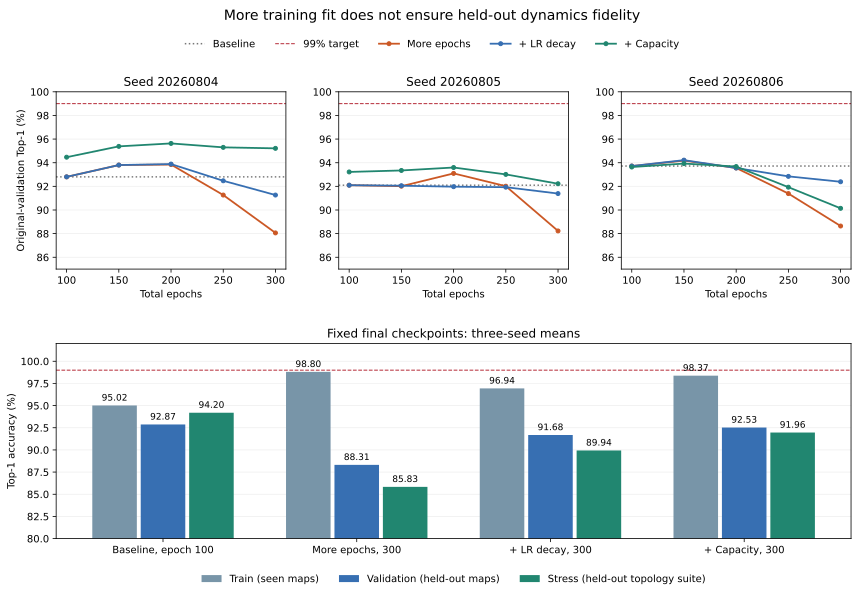

# Bounded Top-1 model-quality study

This separate study pauses new abstraction work and asks whether modest training
changes can lift JEPA Top-1 accuracy to 99–100%, and whether a validation-selected
improvement also improves behavioral and temporal fidelity. Previous checkpoints
and formal experiment outputs are preserved. The learning, decoder, verification
and environment source modules are unchanged.

The [fixed protocol](../configs/top1_quality_protocol.json) limits the study to
three configurations and three seeds, with no subsequent tuning. **Decision: stop this tuning round and retain the original baseline.** All nine
predeclared runs completed. No candidate exceeded baseline mean original-validation
accuracy or reached 99% on validation/stress. This is a negative result for these
limited controls, not a proof of an architectural accuracy ceiling.

## Completed accuracy results

Three-seed means, weighted over all transitions within each split:

| Configuration | Train | Original validation | Stress | Rotated validation |
| --- | ---: | ---: | ---: | ---: |
| Baseline (100 epochs) | 95.02% | 92.87% | 94.20% | 92.25% |
| More epochs (300) | 98.80% | 88.31% | 85.83% | 86.48% |
| More epochs + LR decay | 96.94% | 91.68% | 89.94% | 89.77% |
| More capacity + LR decay | 98.37% | 92.53% | 91.96% | 90.07% |

Every fixed seed and candidate is reported below. Each accuracy is exhaustive;
the stress error denominator is 2,976 for every row.

| Configuration | Seed | Train | Validation | Stress | Stress errors |
| --- | --- | ---: | ---: | ---: | ---: |
| Baseline (100 epochs) | 20260804 | 94.57% | 92.80% | 95.09% | 146 |
| Baseline (100 epochs) | 20260805 | 94.47% | 92.10% | 92.07% | 236 |
| Baseline (100 epochs) | 20260806 | 96.01% | 93.72% | 95.43% | 136 |
| More epochs (300) | 20260804 | 98.97% | 88.06% | 87.06% | 385 |
| More epochs (300) | 20260805 | 98.99% | 88.23% | 82.80% | 512 |
| More epochs (300) | 20260806 | 98.46% | 88.64% | 87.63% | 368 |
| More epochs + LR decay | 20260804 | 97.11% | 91.26% | 90.36% | 287 |
| More epochs + LR decay | 20260805 | 96.90% | 91.39% | 87.47% | 373 |
| More epochs + LR decay | 20260806 | 96.81% | 92.39% | 92.00% | 238 |
| More capacity + LR decay | 20260804 | 98.82% | 95.22% | 90.86% | 272 |
| More capacity + LR decay | 20260805 | 97.87% | 92.22% | 93.55% | 192 |
| More capacity + LR decay | 20260806 | 98.44% | 90.14% | 91.47% | 254 |



The curve markers are the predeclared evaluation epochs, not every epoch. Only
the fixed epoch-300 candidate checkpoints were eligible. The highest observed
individual validation checkpoint was 95.63% (capacity, seed 20260804, epoch 200);
no checked intermediate checkpoint reached 99%. It was not retroactively selected.

## What the controls diagnose

- More epochs improve fit on seen maps (95.02% to 98.80% mean train accuracy),
  while validation falls to 88.31% and stress to 85.83%. This is overfitting,
  rather than evidence that a lower training loss makes the held-out graph better.
- LR decay reduces the damage but remains below baseline: 91.68% validation and
  89.94% stress. Simply lowering the final LR did not reach the target.
- Capacity grows from 90,776 to 212,056 trainable parameters (2.34x). Seed 20260804
  improves validation from 92.80% to 95.22%, but loses stress accuracy from 95.09%
  to 90.86%. Seed 20260806 regresses on validation; the three-seed capacity mean
  remains below baseline. Capacity also changes latent dimension, so this is one
  concrete capacity control, not an isolated proof about every capacity choice.
- Exact retrieval arithmetic is not the observed bottleneck: float32 and direct
  float64 rankings choose the same Top-1 target in all 207,936 recorded predictions
  across the 12 baseline/candidate evaluations. The learned geometry and predictor
  can still place predictions on the wrong side of a nearest-neighbour boundary.
- Epoch 100 has incomplete training fit, but prolonging fit does not resolve the
  main held-out limitation. These controls implicate generalization and the learned
  representation/prediction objective; they do not isolate their individual causal
  contributions. Loss values across different latent dimensions are not comparable
  substitutes for Top-1 accuracy.

No training data were added. In-sample fit is reported separately from map-level
held-out generalization, and the already-inspected stress suite is never used for
configuration or checkpoint selection.

## Behavior and temporal verification

The validation selection includes baseline; **the selected best is baseline**.
The runner replayed that selected checkpoint set as well. These identical-weight
replays are not a comparison with a new model and do not count as improvement
evidence. No candidate passed the predeclared clear-improvement gate.

| Baseline / selected best | Initial states, out of 72 maps |
| --- | ---: |
| Real simulated by Top-1, actions ignored | 33 |
| Top-1 simulated by real, actions ignored | 46 |
| Bisimulation, actions ignored | 23 |
| Action-labelled simulation in either direction / bisimulation | 23 |
| All six CTL verdicts agree | 52 |
| All six LTL verdicts agree | 70 |

| Model seed | CTL all-six | LTL all-six | Bisimulation |
| --- | ---: | ---: | ---: |
| 20260804 | 21/24 | 24/24 | 8/24 |
| 20260805 | 13/24 | 22/24 | 7/24 |
| 20260806 | 18/24 | 24/24 | 8/24 |

The six CTL and six LTL suites differ. The higher LTL score is not evidence of a
better backend or a stronger behavioral match: for example, the real graph has
only 72/2,232 positive state-level cases for `F goal` and `safe U goal`.
All-state agreement is 12,431/13,392 (92.82%) for CTL and 13,067/13,392 (97.57%)
for LTL. Per-property confusion matrices are in the aggregate JSON.

On nuXmv 2.2.0, native CTL versus nuXmv CTL agrees on **26,784/26,784** verdicts.
`AG !danger` / `G !danger` and `AF goal` / `F goal` each agree on **4,464/4,464**
state-specific checks. Both logic encodings use the same graph, labels and
state-specific initialization, with no fairness. All 8,928 paired LTL verdicts
also agree with the separate six-formula LTL run. No backend mismatches occurred.
The repeated selected-best run has byte-identical graph exports and the same
results. The original formal **52/72 remains unchanged**.

This round therefore does not establish either proposed implication. Held-out
stress Top-1 prediction did not improve consistently, so the premise needed to
test a temporal-fidelity gain was not achieved. No local-uncertainty abstraction
or error-bound certification was attempted.

## Saved models and audits

`outputs/top1_quality/round1/model_bank.json` identifies three roles:

- `baseline`: the three original, byte-identical checkpoints;
- `best`: the same baseline checkpoints, selected by validation;
- `best_new_candidate`: the three `capacity_cosine` checkpoints, retained as the
  highest-validation new configuration, **without claiming that they beat baseline**.

All nine candidate checkpoints, optimizer/RNG states, histories, exhaustive
predictions, graph certificates and nuXmv inputs/logs remain in the private record
archive. It also includes the original baseline checkpoints and source graph
export for local reproduction. Extract into a fresh checkout to preserve any
separate local results. The repository contains this report, the fixed protocol,
reproduction code, figure and [aggregate JSON](results/top1_quality/summary.json).

Audit results: 207,936 transition records replayed for coverage, concrete truth
and accuracy accounting; identical training-tensor hashes across all nine runs;
578 pre-existing output/source files unchanged; 37 targeted tests passed with no
skips. The full original baseline graph/relation records match, with 432 greatest-
relation certificate checks and 144 independent bisimulation partition checks.

## Baseline diagnosis

All transitions are enumerated, including unreachable states. Training uses
exactly the original 40 maps / 4,736 transitions. Validation uses the original
20 held-out maps / 2,404 transitions. The 24 topology stress maps contribute
2,976 transitions per seed. No stress or validation transitions are trained on.
The 50 pilot test maps remain unscored in this study.

| Seed | Train | Original validation | Stress | Stress errors |
| --- | ---: | ---: | ---: | ---: |
| 20260804 | 94.57% | 92.80% | 95.09% | 146 |
| 20260805 | 94.47% | 92.10% | 92.07% | 236 |
| 20260806 | 96.01% | 93.72% | 95.43% | 136 |

Three rotations of each validation map are additional diagnostics, never a
selection criterion. Original training goals occupy one corner, whereas the
stress suite rotates goals. This is a possible distribution difference; the
diagnostic does not assume it explains the errors.

Exhaustive float32 `torch.cdist` decoding is compared with independent float64
direct subtraction on the same embeddings. All 51,984 transition predictions
agree. Target-embedding self retrieval succeeds on all 12,996 checked map states;
there are no target-state collisions. Stress Top-2 accuracy is 99.90%, 99.76%,
and 100%. The dominant issue is therefore which nearby target wins, rather than
an approximate search or a floating-point retrieval bug. Position-only and
learned-only distance ablations are reported as diagnostics; neither replaces
the decoder or enters model selection.

Baseline stress error counts by family and action (all fixed seeds retained):

| Group | 20260804 | 20260805 | 20260806 |
| --- | ---: | ---: | ---: |
| sealed_region (960 transitions/seed) | 33 | 84 | 52 |
| danger_gate (992) | 57 | 81 | 44 |
| safe_detour (1,024) | 56 | 71 | 40 |
| up (744) | 13 | 54 | 21 |
| down (744) | 29 | 23 | 65 |
| left (744) | 71 | 63 | 13 |
| right (744) | 33 | 96 | 37 |

Across stress maps, 464/518 errors are false self-loops and 54/518 are nonlocal
predictions; 508/518 errors still rank the true successor second. Errors can be
systematic at a state-action: seed 20260804 gets `(4,2), left` wrong in all 20
stress maps where that source exists; seed 20260805 gets `(0,3), right` wrong in
all 18 such maps. These groups combine different map contexts, not repeated
observations of one identical transition. Exact per-map, state-action and action
breakdowns are retained in `diagnosis/seed_*/transitions.csv` and `report.json`.

Training boundary-blocked actions have zero errors for all three seeds.
Wall-blocked actions have 207/729, 100/729, and 74/729 errors; free moves have
50/3,196, 162/3,196, and 115/3,196 errors. At epoch 100 the original loss still
decreases, motivating the bounded epoch/LR/capacity tests. These observations
alone do not separate optimization, representation, and generalization limits.

## Fixed candidate budget and selection

| Configuration | Initialization | Architecture | Epochs | Learning rate after epoch 100 |
| --- | --- | --- | ---: | --- |
| Baseline | Existing saved weights | latent 32, encoder width 32, predictor 64 | 100 | Original 3e-4 |
| `long_constant` | Corresponding baseline | Same | 100 + 200 | 3e-4 |
| `long_cosine` | Corresponding baseline | Same | 100 + 200 | Cosine 3e-4 to 3e-5 |
| `capacity_cosine` | Fresh, same fixed seed | latent 64, encoder width 48, predictor 128 | 300 | Same cosine schedule |

All three use exactly the same training examples, batch size 512, AdamW weight
decay 1e-4, EMA 0.99, and original JEPA loss. Observations are cached to reduce
data-loading cost; no examples are added. No augmentation is used.

The saved baseline bundles lack optimizer and RNG state, so the continuations
explicitly restart AdamW and the data-loader generator at epoch 100. They are
warm starts, not exact resumptions of the old run. The fresh capacity control
also restarts these at epoch 100. Learning rates are constant through epoch 100,
then follow their declared schedules over epochs 101–300.

Only epoch 300 is eligible for a candidate. Intermediate validation at epochs
100, 150, 200 and 250 diagnoses convergence, without selecting checkpoints.
One configuration is selected for all three seeds by mean original-validation
accuracy, including baseline as an eligible option. Ties prefer fewer trainable
parameters and then the listed order. Clear improvement requires at least one
percentage point in mean validation and a gain on every seed. The 99% target is
reported separately for validation and stress. Previously inspected stress maps
are a diagnostic holdout, not a fresh blind test.

## Reproduce in a separate output directory

Clone or update `agent/oracle-latent-radius`, install the project, and extract the
private checkpoint/record archive into the repository root. Raw records and
weights are supplied separately; the repository contains code and aggregate
results. Preserve the original `outputs/latent_radius/...` checkpoint paths and
`outputs/behavioral_relations/top1` graph export. Use a fresh run directory:

```powershell
$run = "outputs/top1_quality/local_run"
python experiments/top1_quality_diagnosis.py --output-dir "$run/diagnosis"
foreach ($candidate in @("long_constant", "long_cosine", "capacity_cosine")) {
    foreach ($seed in @(20260804, 20260805, 20260806)) {
        python experiments/improve_top1.py --run-dir $run --candidate $candidate --seed $seed
        if ($LASTEXITCODE -ne 0) { throw "Training or evaluation failed" }
    }
}
python experiments/improve_top1.py --run-dir $run --select
```

The reports distinguish train, original validation, rotated validation and
stress. Each contains exhaustive state-action predictions, map/family/action/
motion summaries, retrieval margins, loss histories, and checkpoint hashes.
Model bundles retain the original `ActionJEPA(**payload['model_kwargs'])` loading
interface and additionally save optimizer and Torch/data-loader RNG state.
They are compatible with the configurable checkpoint path in
`oracle_latent_radius.py`; historical fixed-checkpoint protocols remain strict.

For the selected model, the behavior runner uses the existing greatest-relation
algorithms, elimination-certificate audits, independent partition refinement,
and six CTL formulas. Baseline replay must reproduce every original graph and
entire relation record. The same graph exports feed the existing six-formula
nuXmv LTL runner and strict CTL/paired-formula sanity checker, with no fairness:

```powershell
$env:NUXMV_BINARY = "C:/path/to/nuXmv.exe"
foreach ($model in @("baseline", "best")) {
    python experiments/quality_behavioral.py --run-dir $run --model $model
    python experiments/evaluate_top1_ltl.py --run-dir "$run/behavioral/$model" --output-dir "$run/temporal/${model}_ltl"
    python experiments/backend_sanity.py --run-dir "$run/behavioral/$model" --output-dir "$run/temporal/${model}_sanity"
}
python experiments/summarize_top1_quality.py --run-dir $run
```

Only claims about the enumerated finite graphs follow from these checks.
Higher average Top-1 accuracy alone does not imply simulation, bisimulation,
monotone temporal improvement, or a certified local uncertainty bound. This
round does not construct or tune a new abstraction.
