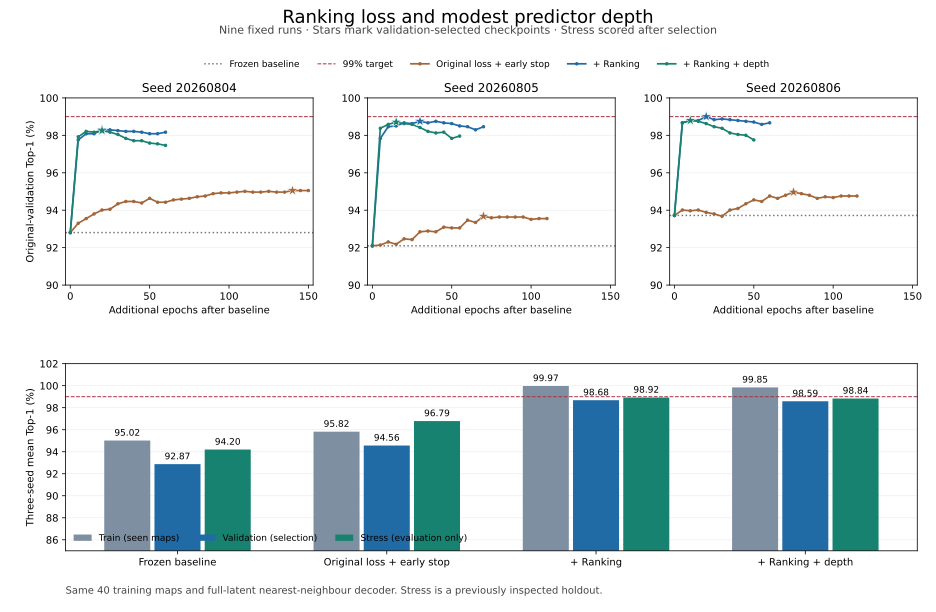

# Bounded ranking and predictor-depth study (round 2)

**Decision: use `ranking` as the improved prediction model and retain the original
baseline. Stop this tuning round.** All nine predeclared runs completed. Ranking
improves every seed on both validation and stress while retaining the original
90,776 trainable parameters. Adding one predictor block (99,224 parameters) gives
no further gain in this comparison. Held-out performance approaches 99%, but this
round does **not** achieve 99–100% on every seed or establish perfect transitions.

## Completed accuracy results

Means over the three fixed seeds; each split has the same denominator per seed:

| Model | Train | Validation | 24 stress maps | Rotated validation |
| --- | ---: | ---: | ---: | ---: |
| Original baseline | 95.02% | 92.87% | 94.20% | 92.25% |
| Original loss + early stopping | 95.82% | 94.56% | 96.79% | 94.00% |
| **Ranking loss** | **99.97%** | **98.68%** | **98.92%** | **98.08%** |
| Ranking + predictor depth | 99.85% | 98.59% | 98.84% | 97.94% |

Validation improves by **5.81 percentage points** over baseline, and by **4.12
points** over the matched original-loss control. Stress errors fall from **518
to 96 out of 8,928 transitions**, an 81.47% reduction. Across the 72 seed/map pairs,
Top-1 improves on 70, ties on two, and worsens on none.

| Model | Seed | Selected extra epochs | Train | Validation | Stress | Stress errors / 2,976 |
| --- | --- | ---: | ---: | ---: | ---: | ---: |
| Baseline | 20260804 | 0 | 94.57% | 92.80% | 95.09% | 146 |
| Baseline | 20260805 | 0 | 94.47% | 92.10% | 92.07% | 236 |
| Baseline | 20260806 | 0 | 96.01% | 93.72% | 95.43% | 136 |
| Original loss + early stopping | 20260804 | 140 | 96.11% | 95.05% | 97.18% | 84 |
| Original loss + early stopping | 20260805 | 70 | 95.40% | 93.68% | 95.43% | 136 |
| Original loss + early stopping | 20260806 | 75 | 95.95% | 94.97% | 97.75% | 67 |
| **Ranking** | **20260804** | **20** | **99.96%** | **98.29%** | **99.03%** | **29** |
| **Ranking** | **20260805** | **30** | **99.98%** | **98.75%** | **98.12%** | **56** |
| **Ranking** | **20260806** | **20** | **99.98%** | **99.00%** | **99.63%** | **11** |
| Ranking + depth | 20260804 | 20 | 99.87% | 98.25% | 98.99% | 30 |
| Ranking + depth | 20260805 | 15 | 99.83% | 98.71% | 97.98% | 60 |
| Ranking + depth | 20260806 | 10 | 99.83% | 98.79% | 99.53% | 14 |



The selected ranking checkpoints are total epochs **120, 130, 120**, after the
original 100-epoch baseline. Training continued until the fixed patience rule
stopped those runs at additional epochs 60, 70, 60. All nine runs together used
730 additional epochs; no extra hyperparameter trials were added.

The loss mismatch is a substantial contributor under these controls: ranking
improves held-out accuracy beyond the same-batching, same-LR, same-selection
control. False self-loop errors fall from 464 to 74; nonlocal predicted moves
fall from 54 to 22. Of the 96 remaining stress errors, 92 still rank the true
successor second. This is not an arithmetic fix: canonical float32 and independent
direct float64 retrieval agree on all **207,936** audited baseline/candidate
predictions. Additional predictor depth is unnecessary for the observed gain.

## Behavioral and temporal comparison

All counts below use the same 72 real graphs, labels, initial states and six
formulas per logic. The old baseline records are reused and hash-checked; the
new ranking graphs are checked by the existing exact relation and nuXmv pipelines.

| Measure | Original baseline | Ranking |
| --- | ---: | ---: |
| Initial: real simulated by Top-1, actions ignored | 33/72 | **60/72** |
| Initial: Top-1 simulated by real, actions ignored | 46/72 | **58/72** |
| Initial bisimulation, actions ignored | 23/72 | **40/72** |
| Initial action-labelled simulation / bisimulation | 23/72 | **40/72** |
| Initial all-six CTL agreement | 52/72 | **68/72** |
| Initial all-six LTL agreement | 70/72 | **70/72** |
| CTL state/property agreement | 12,431/13,392 (92.82%) | **13,197/13,392 (98.54%)** |
| LTL state/property agreement | 13,067/13,392 (97.57%) | **13,282/13,392 (99.18%)** |

For deterministic, total, action-labelled graphs here, both simulation directions
and bisimulation coincide. This statement does not apply to ordinary unlabelled
simulation. The ranking model now has initial bisimulation on **10 danger-gate
and 8 safe-detour cases**, compared with zero in both families for baseline.
Sealed-region bisimulation falls from 23/24 to 22/24.

| Seed | CTL all-six, baseline → ranking | LTL all-six | Bisimulation |
| --- | ---: | ---: | ---: |
| 20260804 | 21 → 23 | 24 → 23 | 8 → 10 |
| 20260805 | 13 → 21 | 22 → 23 | 7 → 10 |
| 20260806 | 18 → 24 | 24 → 24 | 8 → 20 |

**Better Top-1 improves aggregate behavioral fidelity here, but it does not
guarantee every temporal conclusion.** On seed 20260804,
`sealed_region_layout1_rot90` improves from 95.83% to 99.17% Top-1 while initial
LTL agreement falls from 6/6 to 3/6. Initial CTL also worsens on that map and the
same map for seed 20260805, despite higher transition accuracy in both cases.
Few errors at critical edges can matter more than many harmless errors.

The following confusion counts use all 2,232 states per property. A false
positive means Top-1 says true while the real graph says false.

| CTL property | Baseline FP / FN | Ranking FP / FN |
| --- | ---: | ---: |
| `EF danger` | 24 / 81 | 36 / 0 |
| `EF goal` | 12 / 412 | 36 / 8 |
| `E[!danger U goal]` | 48 / 279 | 54 / 25 |
| `AG !danger` | 81 / 24 | 0 / 36 |
| `AF goal` | 0 / 0 | 0 / 0 |
| `EG safe` | 0 / 0 | 0 / 0 |

Thus increased agreement does not mean all false-positive rates decrease.
The CTL and LTL suites differ, so their all-six rates should not be compared as
equivalent tests. The strict check on the new graphs again gives:

- Internal CTL versus nuXmv CTL: **26,784/26,784** agree.
- `AG !danger` versus `G !danger`: **4,464/4,464** agree.
- `AF goal` versus `F goal`: **4,464/4,464** agree.
- The same graph/state encoding, labels, nuXmv 2.2.0 binary and no fairness are
  used; all 8,928 paired LTL verdicts agree with the separate full LTL run.
- nuXmv confirms the new **68/72** CTL result. The historical **52/72** remains
  unchanged for the preserved baseline.

This supports using `ranking` for subsequent prediction comparisons. It neither
certifies unseen maps nor establishes tighter local uncertainty sets; no new
abstraction, error-bound certification or formula was introduced in this round.

## Fixed design and objective

This user-authorized second round preserves the original checkpoints and all
round-1 results. It tests a concrete objective mismatch: the baseline minimizes
latent regression error, while evaluation chooses the closest same-map target.
In the frozen baseline, 508 of 518 stress errors have the true successor ranked
second. Direct float64 and canonical float32 retrieval arithmetic agreed; this
motivates training the ordering, not replacing the decoder with an oracle.

The [fixed protocol](../configs/top1_ranking_protocol.json) predeclares exactly
three configurations and three seeds. All warm-start the original epoch-100
weights, restart AdamW, use a cosine learning rate from 1e-4 to 1e-5 over at most
150 additional epochs, and retain the same 40 training maps (4,736 transitions).
Validation is checked every five epochs. Each seed retains its best validation
checkpoint, including epoch zero; eight checks without improvement trigger early
stopping after at least 40 epochs. A single configuration is then selected across
all three seeds using mean original-validation accuracy, with baseline eligible.
Selection is frozen **before** any new stress evaluation. The previous round's
final-epoch-only rule is not reused.

| Candidate | Objective | Predictor change |
| --- | --- | --- |
| `earlystop_control` | Original JEPA loss | None |
| `ranking` | Original loss + 0.1 ranking CE | None |
| `ranking_depth` | Same ranking objective | One residual hidden block |

For prediction $p_i$, detached EMA targets $z_j$, and true successor index $t_i$:

$$
\ell_{rank}(i)=-\log\frac{\exp(-\|p_i-z_{t_i}\|_2^2/\tau)}
{\sum_{j\in S_{map(i)}}\exp(-\|p_i-z_j\|_2^2/\tau)},\qquad \tau=1.
$$

The source state is a candidate, and negatives are all other valid states from
the same **training** map. Targets are detached; context encoder and predictor
receive gradients, and the target encoder keeps its original EMA update. This
adds a contrastive ranking term to JEPA; it is not the original negative-free
objective. The four-channel observation, two-convolution encoder, latent size
32, fixed position features, action embedding and full-latent Euclidean decoder
stay unchanged. The new hidden block is LayerNorm/Linear/GELU/Linear with a
zero-initialized final layer inside a residual connection. It initially preserves
the baseline function exactly. Default model arguments retain old checkpoint keys.

Training groups four complete maps per batch, with ten optimizer updates per
epoch and every original transition exactly once. Shared states are encoded once
per batch, then their contexts are repeated for four actions. All candidates use
this batching, including the control; ranking comparisons are therefore matched.
The control differs from the historical baseline continuation in batching,
learning-rate budget and validation selection, so it isolates the new objective
only within this round. There is no data augmentation or test-transition training.
Stress remains an already-inspected diagnostic holdout, not a new blind test.

## Reproduce

Install the project in a fresh checkout and extract the private record archive
there to restore the original checkpoints. Use a fresh output directory for any
new run; commands refuse to overwrite completed results. From the repository root:

```bash
python -m pip install -e .
python -m experiments.improve_top1_ranking --run-dir outputs/top1_quality/round2_local --phase initialize
```

For each candidate above and each seed `20260804`, `20260805`, `20260806`, run:

```bash
python -m experiments.improve_top1_ranking --run-dir outputs/top1_quality/round2_local --phase train --candidate ranking --seed 20260804
```

After all nine training runs, freeze selection once, then evaluate every saved
validation-best model using the same candidate/seed combinations:

```bash
python -m experiments.improve_top1_ranking --run-dir outputs/top1_quality/round2_local --phase select
python -m experiments.improve_top1_ranking --run-dir outputs/top1_quality/round2_local --phase evaluate --candidate ranking --seed 20260804
python -m experiments.quality_behavioral --run-dir outputs/top1_quality/round2_local --model best
```

The existing `backend_sanity.py` and `evaluate_top1_ltl.py` accept the resulting
`outputs/top1_quality/round2_local/behavioral/best` graph directory. No formula,
label, graph semantics, fairness or verification algorithm is changed here.

For example, complete the selected model's formal checks with:

```bash
python -m experiments.backend_sanity --run-dir outputs/top1_quality/round2_local/behavioral/best --output-dir outputs/top1_quality/round2_local/temporal/best_sanity --executable /path/to/nuXmv
python -m experiments.evaluate_top1_ltl --run-dir outputs/top1_quality/round2_local/behavioral/best --output-dir outputs/top1_quality/round2_local/temporal/best_ltl --executable /path/to/nuXmv
python -m experiments.summarize_top1_ranking --run-dir outputs/top1_quality/round2_local
```

On Windows, use the configured virtual environment's `python.exe` and the path
to `nuXmv.exe`; the module commands otherwise remain the same. To test saved
weights without training, read `outputs/top1_quality/round2/model_bank.json` and
run the behavioral command above with a fresh output directory and a copy of
`selection.json`. That file points to all three selected checkpoints.

## Models, records and integrity

`outputs/top1_quality/round2/model_bank.json` identifies `baseline` and `best`.
The latter points to the three `ranking/seed_*/model.pt` validation-best models.
All nine best checkpoints and nine final checkpoints retain model, optimizer
and RNG states. No original checkpoint or formal result was overwritten.

The public repository contains code, this report, the curve and the
[aggregate JSON](results/top1_ranking/summary.json). The private ZIP contains
weights, full predictions, training histories, graph certificates, nuXmv inputs
and logs, baseline comparison records and checksums. It excludes the nuXmv binary;
install your own executable for local backend runs. The reference runtime used
Python 3.12.14 and PyTorch 2.14.0+cpu with four threads per training process.

Audits passed: **2,128 pre-existing output files unchanged**, 207,936 exhaustive
transition records checked, original training-tensor hashes identical in every
run, 432 relation certificates, 144 independent bisimulation partition checks,
396,504 CTL preservation checks over retained relation pairs, and **27 unit tests**.
The actual 72 real graph/label/initial encodings match the baseline exactly.

Training protocol and implementation were committed before running at
`21fab50923c6d88eee9a8ef92b7be66f9deb4ff2`. After training, one report-only check
was fixed: `correct/total` and `1-errors/total` differ by one floating-point ULP
for control seed 20260805. Validation checking now compares exact integer error
and transition counts. Its existing raw export was audited and validation was
replayed before finalizing the report. This changed no model weights, predictions,
training decisions or frozen configuration selection.
